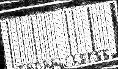

# Точная локализация бар-кода
Точная локализация бар-кодов. Необходимо проработать алгоритм, который выделяет на изображении праильно ориентированную границу бар-кода, при этом на изображении он должен быть только один (то есть после грубой локализации баркодов).

**P.S**: Правильная ориентация определяется двумя условиями:
1. Бар-код находится слева от границы при обходе контура.
2. Первая точка границы - левая нижняя точка, если бы бар-код был бы эталонным.


# API
- **Входные данные:** Карта Instance segmentation. То есть, отображение вида ``R x R -> N + {0}`` в виде двумерного массива, где каждый элемент обозначает принадлежность соответствующего пикселя к ``i-ому`` бар-коду.
- **Выходные данные:** Массив, вида, который обозначает границы:
```
List[Tuple(uint, uint)]
```

# Точная локализация

Задача, на текущий момент, может решаться двумя способами:
1. Использовать результаты сегментации, найти положительно ориентированный контур выделенного бар-кода.
2. Использовать алгоритмический подход, основанный на различных фильтрах (аналогично алгоритму [Canny](https://en.wikipedia.org/wiki/Canny_edge_detector)).

Так как первый способ требует готового сегментатора, в этом отчете сосредоточимся на втором.

Рассмотрим работу алгоритма на следующем примере:


Алгоритм состоит из нескольких шагов:
1. Найти на изображении "градиенты" каждого пикселя, с помощью фильтра [Собеля](https://ru.wikipedia.org/wiki/Оператор_Собеля), предварительно сделав изображение черно-белым

2. Заблюрить изображение фильтром Гаусса, чтобы сгладить области с большими перепадами градиентов, а затем применить фильтр thresh, который считает все пиксели белыми, если их яркость превышает заданный порог (в алгоритме = 210).

3. Как видно, на изображении заметны "дырки", которые прямоугольным ядром, дозаполняются.

4. Затем, выделятся замкнутый контур, наибольший по площади, тем самым получается результирующая картинка.


Для метрики, в качестве очень базовой оценки, используется Intersection over Union (IoU).

# Текущие проблемы
1. Не очень понятно, как корректно выбирать пороги и параметры всех использующих фильтров. Например, на плохо контрастирующей картинке, по-хорошему нужно подбирать порог, исходя ис значения максимального градиента. Или, при процессе "дозаполнения всех дырок" в 3 пункте алгоритма, алгоритм плохо показывает себя на вертикально повернутых штрихкодах

2. Плохо работает на QR-кодах, нужно думать либо о модификации алгоритма, либо придумывать что-то другое.


# Текущие результаты
Результаты по всему обучающему датасету можно посмотреть, запустив `test.py`.


# Инструкция по запуску
## Установка зависимостей
Установить все необходимые пакеты можно следующей командой:
```
pip install -r requirements.txt
```
## Запуск скрипта
Скрипт возвращает картинку, с выделенной границей
```
python main.py -i /path/to/image -o /path/to/output

- -i, --image: Required. The path to the input image.
- -o, --output: Optional. The path to save the output image. Defaults to 'res.png' if not provided.
```
## Запуск тестов
Скрипт, который по тестовому датасету выделяет границы на всех изображениях, при этом также возращает промежуточные результаты работы фильтров.
```
python test.py -c annotations.json -d training_data -o output

- -c: Path to VGG annotator config
- -d: Path to corresponding training dataset
- -o: Path to output the images with contours of bar-codes
```